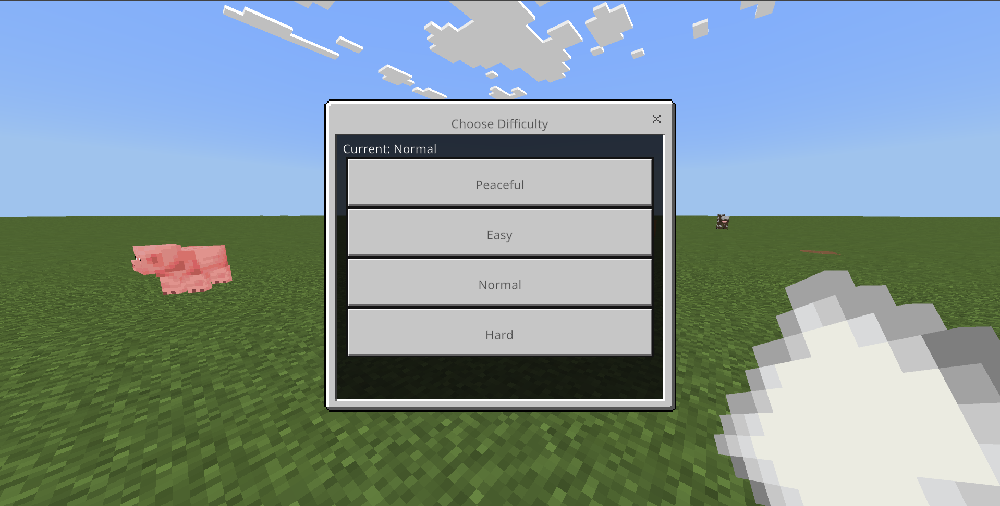

# Difficulty Switcher

A Minecraft Bedrock Edition script that provides a UI for switching game difficulty without requiring cheats.

## Installation

1.  [Download the latest `MCDifficultySwitcher.mcpack` from the latest release.](https://github.com/acomagu/MCDifficultySwitcher/releases/latest/download/MCDifficultySwitcher.mcpack)
2.  Open the downloaded file with Minecraft to import it.

## How to Use

1.  Get a piece of paper in the game.
2.  Rename it to "Difficulty Menu" using an anvil.
3.  Use (right-click) the renamed paper to open the difficulty selection menu.
